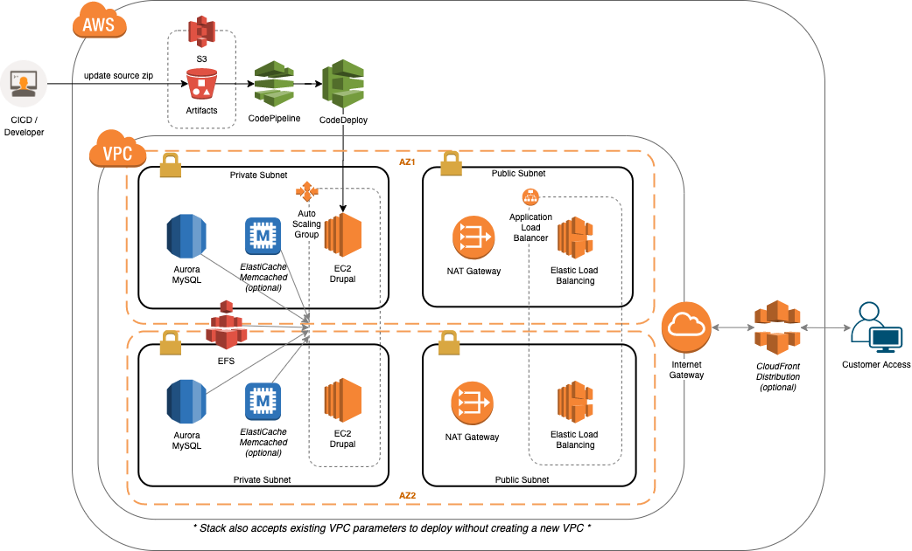

# Drupal on AWS Pattern

The Ordinary Experts Drupal Pattern is an open-source AWS CloudFormation template that offers an easy-to-install AWS infrastructure solution for quickly deploying a Drupal project, using both AWS and Drupal best practices. The template makes it easy to spin up a production-ready, full-feature infrastructure ready to host scalable Drupal app in the AWS cloud.

Drupal is a free and open-source web content management framework written in PHP, providing powerful tools to meet a broad range of web application needs. This template provides a base Drupal application or can be provided with an existing Drupal project. Based on the environment set-up, our stack can run Drupal versions 8.8 and above, with Drupal 9 as the default Drupal installation.

Want to get started?  Read the [Deployment Guide](DEPLOYMENTGUIDE.md).

## Current Drupal Environment Configurations

* Apache 2.4.7
* MySQL 5.7.8
* PHP 7.3.0
* Drupal 9.0.0
* Composer 1.9
* Memcache 2.1
* Drush 10.2

The AWS stack uses Amazon Elastic Compute Cloud (Amazon EC2), Amazon Virtual Public Cloud (Amazon VPC), Amazon Aurora, Amazon Elastic File System (Amazon EFS), Amazon Simple Storage System (Amazon S3), AWS CodePipeline, AWS CodeBuild, AWS CodeDeploy, Amazon Secrets Manager, Amazon ElastiCache, and Amazon CloudFront.

Automatically configured to support auto-scaling through AWS Autoscaling Groups, this solution leverages an EFS file system to share user generated content between application servers. Additionally, our solution includes a CodePipeline which actively monitors a deployment location on AWS S3 making continuous integration and deployment throughout your infrastructure easy.

We enable SSL by default by providing an existing ACM certificate to the automation.

The template ensure multi-level security by incorporating AWS IAM for federated access to resources with least privilege and AWS managed keys and Secret Manager to manage secrets for encryption of data at rest and in transit. More information regarding the security features are available in the [deployment guide](DEPLOYMENTGUIDE.md/#security).

We support multiple availability zones using an RDS Aurora MySQL cluster and Amazon's integrated options to distribute infrastructure.

Regions supported by Ordinary Experts' stack:

| Fully Supported | Unsupported |
| -------------- | ----------- |
| <ul><li>us-east-1 (N. Virginia)</li><li>us-east-2 (Ohio)</li><li>us-west-1 (N. California)</li><li>us-west-2 (Oregon)</li><li>ca-central-1 (Central)</li><li>eu-central-1 (Frankfurt)</li><li>eu-north-1 (Stockholm)</li><li>eu-west-1 (Ireland)</li><li>eu-west-2 (London)</li><li>eu-west-3 (Paris)</li><li>ap-northeast-1 (Tokyo)</li><li>ap-northeast-2 (Seoul)</li><li>ap-south-1 (Mumbai)</li><li>ap-southeast-1 (Singapore)</li><li>ap-southeast-2 (Sydney)</li><li>sa-east-1 (Sao Paolo)</li></ul> | <ul><li>eu-south-1 (Milan)</li><li>ap-east-1 (Hong Kong)</li><li>me-south-1 (Bahrain)</li><li>af-south-1 (Cape Town)</li></ul> |

Optional configurations include the following:
* Integration of CloudFront as a CDN solution
* ElastiCache caching layer, ready for easy configuration with the CDN and memcached modules for Drupal.
* Contain your Drupal infrastructure in a new VPC, or provide this CloudFront stack with an existing VPC id and subnets.

Comprehensive, professional cloud hosting for Drupal at the click of a button.

## Drupal Stack Infrastructure

## Infrastructure Cost Estimates

We have prepared the following AWS Simple Monthly Calculator links to help estimate the cost of running different configurations of this infrastructure:

* [Basic with minimum options](https://calculator.s3.amazonaws.com/index.html#r=IAD&key=files/calc-086962bc481edc37a0b1d159f74375dd23c92ca8&v=ver20200610dP): $121.75 USD / mo
* [Basic with default options](https://calculator.s3.amazonaws.com/index.html#r=IAD&key=files/calc-53dc2f9056a2c23c6ca5e46bbf2a17f57b258080&v=ver20200610dP): $429.33 USD / mo
* [Basic with default options and VPC](https://calculator.s3.amazonaws.com/index.html#r=IAD&key=files/calc-9110ebb90e8a5ce555d796d756e8512483deb533&v=ver20200610dP): $501.97 USD / mo
* [Basic with default options and ElastiCache](https://calculator.s3.amazonaws.com/index.html#r=IAD&key=files/calc-8d532112abf9ad1f25b13070f10495a6f1186a51&v=ver20200610dP): $454.23 USD / mo
* [Basic with default options and CloudFront](https://calculator.s3.amazonaws.com/index.html#r=IAD&key=files/calc-f0df89ffe75796bf1dea267462ff91a82531e0cc&v=ver20200610dP): $439.07 USD / mo
* [Fully loaded with default options](https://calculator.s3.amazonaws.com/index.html#r=IAD&key=files/calc-f03799f13f8e4fbd2b6566367b330dcc328c9d1a&v=ver20200610dP): $532.11 USD / mo

## Setup

We are following the [3 Musketeers](https://3musketeers.io/) pattern for project layout / setup.

First, install [Docker](https://www.docker.com/), [Docker Compose](https://docs.docker.com/compose/), and [Make](https://www.gnu.org/software/make/).

Detailed information about the architecture and step-by-step instructions are available on our [deployment guide](DEPLOYMENTGUIDE.md).

## Development

See [DEVELOPMENT.md](DEVELOPMENT.md).

## Feedback

To post feedback, submit feature ideas, or report bugs, use the [Issues section](https://github.com/ordinaryexperts/aws-marketplace-oe-patterns-drupal/issues) of this GitHub repo.
